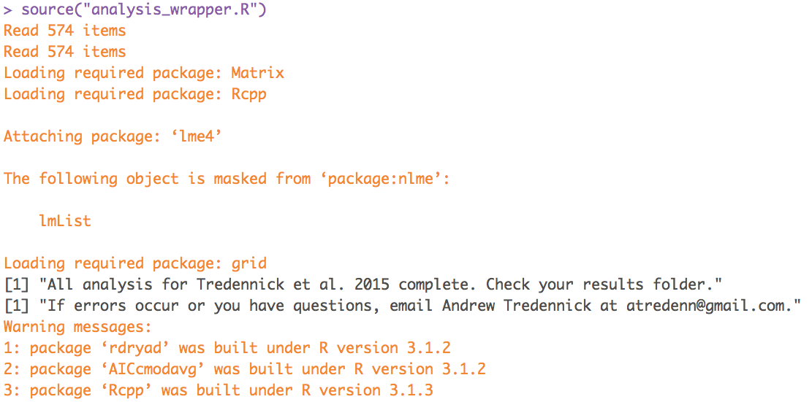

ReadMe 
======

This is a 'read me' file for data and code associated with "No effects of fire, large herbivores, and their interaction on regrowth of harvested trees in two West African savannas" by Andrew T. Tredennick,  Moussa Karembé, Fadiala Dembélé, Justin Dohn, and Niall P. Hanan in review at the _African Journal of Ecology_ (Tredennick et al. 2015). In 2010 we implemented a tree harvest experiment within an existing fully factorial fire and hebivore manipulative experimental structure at two sites in Mali, West Africa (the main experiment is the Sahelian Savanna Disturbance Experiment [SSDE]).

### Paper abstract
>Theory and empirical evidence for the impacts of fire and herbivory in savannas is well established – they are top-down disturbances that maintain savannas in disequilibrium states away from potential tree cover. In African savannas the demand for fuelwood is extremely high, so tree harvest likely also has an impact, both directly and indirectly, on tree cover, density, and biomass. Many savanna trees resprout vigorously from the base after harvest. However, harvested trees regenerate as saplings susceptible to fire and browsing, so harvest may have important demographic consequences. Here, we report the effects of tree harvest, and its interaction with fire and herbivory, on savanna dynamics by analyzing woody regrowth following a harvest in arid Sahelian and mesic Guinean savannas in Mali, West Africa. Tree harvest resulted in an overall reduction in wood production per tree compared to growth in non-harvested trees. Regrowth, either biomass or height, did not differ among fire and herbivory treatments. Our results suggest that the resprouting abilities that savanna trees have evolved to cope with frequent fire are essential for surviving tree harvest and subsequent disturbance. In these savannas, regrowth is rapid enough in the first growing season to escape the impact of dry season fires.

Funding for this work was provided by National Science Foundation grant #5333870 awarded to Niall Hanan and by NASA Headquarters under the Earth and Space Science Fellowship Program awarded to Andrew Tredennick (NNX11AL43H).

_Send questions to_: Andrew Tredennick (atredenn@gmail.com)

General Information
-------------------
This directory contains all of the data and R code necessary to reproduce the analysis and figures from Tredennick et al. 2015. The easiest way to reproduce our results in a snap is to run ``Rscript analysis_wrapper.R`` from the command line when in the directory ``your/path/to/ssde_harvest_dryad/analysis/``, or from within R:

``` {r example, echo=TRUE, eval=FALSE}
# Change your/path/to/ to reflect where you saved the ssde_harvest_dryad/
#   directory on your local machine
# For example: /username/Desktop/ssde_harvest_dryad/analysis/
setwd("/your/path/to/ssde_harvest_dryad/analysis/")
source("analysis_wrapper.R")
```

The ``analysis_wrapper.R`` script automatically checks for required packages, and prompts you to install missing packages. The script also automatically checks your version of the ``Rcpp`` package and installs if needed. __The script will not work if your ``Rcpp`` version is not at least 0.11.5__. If you would like to install required packages beforehand, here is an R chunk to copy into the console and run:

``` {r packages, echo=TRUE, eval=FALSE}
packages <- c("ggplot2", "plyr", "reshape2", "ggthemes", "lme4", 
              "gridExtra", "rdryad", "Rcpp", "AICcmodavg")
install.packages(packages)
```

Note that ``analysis_wrapper.R`` creates a new directory within the working directory called ``results/``, and all output from scripts are sent to that directory. So, if you choose to run analysis scripts individually, you should make a directory called ``results/`` first. Otherwise, there will be many errors as the scripts attempt to write results and figures to file.

Running the ``get_allometric_data.R``, and thus the ``analysis_wrapper.R`` script, requires an internet connection because the allometric data is downloaded from Dryad, then subsetted and saved for use in the ``data/`` directory on-the-fly.

You will get several warning messages that can be safely ignored. When you run ``analysis_wrapper.R``, you should get output like this in your R console:



File Structure
--------------
Here is the file structure assuming the root directory is ``ssde_harvest_dryad/``:

### analysis/
* ``analysis/`` -- contains R code for all analyses and figure production. 
    + ``allometry_linear_model.R`` -- fits allometric model to convert diameter to biomass and predict biomass for "control" trees that were not harvested and track with dendrometer bands. Creates Figure S1.
    + ``analysis_wrapper.R`` -- this script creates a ``results/`` directory, runs all the other scripts in this directory and saves the results and figures from the paper to the ``results/`` directory. This one script will reproduce our entire analysis and figures fromt he paper. One stop shopping!
    + ``control_fh_ANOVA.R`` -- runs ANOVAs comparing biomass accumulation in fully protected, harvested trees to fully protected, non-harvested ("control") trees. Creates Figure 2.
    + ``get_allometric_data.R`` -- uses the 'rdryad' package to download the full allometric dataset from Tredennick et al. 2013 _PLoS One_, subsets the dataset for specific sites and whole trees only (original dataset includes measurements of branches)
    + ``height_analysis.R`` -- tests for treatment effects on regrowth heights at each site then runs general linear models to estimate the probability of achieving a threshold height after three years. Creates Figure 4.
    + ``treatment_ANOVA.R`` -- tests for treatment effects on biomass regrowth at each site and each year. Creates Figure 3.
    + ``wet_dry_ratio_test.R`` -- tests for P-value sensitivities to the wet:dry weight ratio for Lakamane in 2013. Creates Figure S2.

### data/
* ``data/`` -- contains all of the data files used in our analysis. Short descriptions follow, but see documentation in the ``metadata/`` directory for more details. 
    + ``allometry_data_main_stems.csv`` -- subset of data from Tredennick et al. 2013 (http://datadryad.org/resource/doi:10.5061/dryad.4s1d2). Contains measurements of diameter and biomass from harvested trees for estimating allometric relationships. **This file is not present until the script ``get_allometric_data.R`` runs because the data is downloaded from Dryad and formatted for use on-the-fly.**
    + ``control_trees_growth_2011-2013.csv`` -- observations of intial diameter (from 2010) and diameter growth from dendrometer bands measured in 2011 and 2013. These are used to estimate annual biomass accumulation in fully protected, non-harvested ("control") trees.
    + ``heights2013.csv`` -- observations of heights in 2013 of trees initially harvested in 2010 for all treatments and sites.
    + ``ssde_harvest_trees.csv`` -- master list of harvested tree identifiers including site, treatment, subplot, and species.
    + ``treatment_data.csv`` -- the core dataset for measurements of biomass regrowth for all harvested trees in all treatments at both site and both years.
    + ``tree_initial_diameter.csv`` -- diameter of all harvested and non-harvested trees measured at the begninning of the experiment in 2010.
    + ``tree_regrowth.csv`` -- wet biomass of trees harvested in 2010, measured in either 2011 or 2013 depending on group.
    + ``wet_dry_subsamples.csv`` -- wet and dry weights of wood subsamples used to calculate the wet:dry weight ratio for each species in each year.

### metadata/
* ``metadata/`` -- contains metadata for all data files used in this analysis, which are stored in the ``data/`` directory. They are stored as HTML files and are named exactly as their 'data' counterparts.
